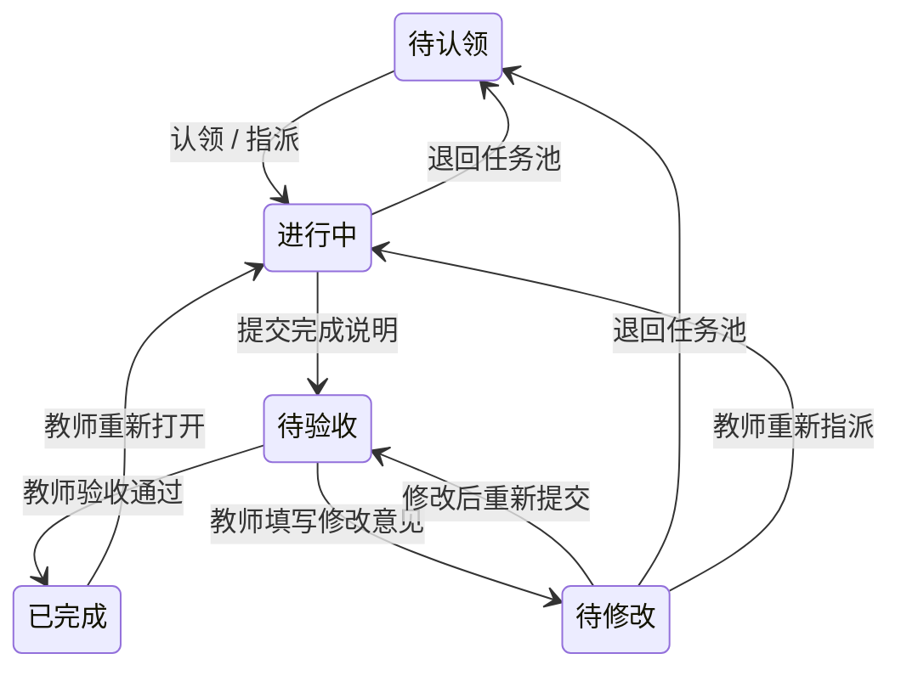

# AgileNest · 高校敏捷项目协作

面向课程设计、实验室课题和竞赛团队。核心链路是：团队空间 → 成员与角色 → 项目目标 → 任务协作 → 教师验收。

本分支版本：**0.3.0-rc.2**（候选版）。版本以 `package.json` 为准，每轮完成验收的集成迭代递增；更新内容与升级要求见 [CHANGELOG.md](CHANGELOG.md)，发布规则见 [开发工作流](docs/WORKFLOW.md#9-迭代版本与发布)。

## 这版体验更新

- 团队、成员和项目使用卡片管理；课程、实验室、竞赛以场景卡片选择。创建/加入成功后自动进入下一步。
- 项目卡片展示任务状态分布与验收完成度，实验室课题可以独立筛选。
- 五态看板支持拖动把手、任务侧边详情和等价按钮操作；提交、重交、打回需要填写说明，指派直接选择姓名。
- 看板/表格共享 URL 筛选，支持搜索、状态、负责人、优先级、里程碑与分组。
- 页面按钮、合法拖拽目标和服务端权限共同使用任务转移表。状态与事件在事务中提交，并发认领只会有一人成功。
- 统一工作台按各项目职务展示本人任务、待验收成果和可认领事项，兼任队员与指导老师不会丢失待办。
- 项目概览中的状态、个人任务与里程碑直接关联相应功能；任务详情可编辑完整信息并拆分子任务，项目完成度只统计已验收的顶层任务。
- 个人中心可维护姓名、简介、头像与学术身份，消息中心可筛选未读并进入对应任务。
- 飞书是可选账号连接，姓名由本人确认后采用；平台资料与权限独立维护。未配置时显示实际状态，解绑校验登录方式和当前绑定版本。
- 侧栏可进入 AI 对话页，整理并管理按账号区分的浏览器草稿；模型尚未接入，内容不向外部服务发送。
- 个人日历管理本人全天或定时安排，支持月历选日、搜索、优先级筛选与版本冲突保护；项目日历继续关联任务截止和里程碑。

详细设计与手动验收见 [docs/UX.md](docs/UX.md)。本期实验室管理覆盖成员、课题和任务，不包含实验数据、文件或设备台账。

## Windows 快速开始

使用编译好的 Windows 发布包时，下载 Release ZIP、完整解压后双击 **start.bat** 即可；自带运行环境、示例数据与停止脚本。[发布包说明与阶段汇总](docs/RELEASE.md)。下面是源码开发方式。

```powershell
.\setup.bat
.\start.bat
```

打开 <http://localhost:3000/login>。环境与便携式 Postgres 说明见 [docs/WINDOWS.md](docs/WINDOWS.md)。

仓库提供通用环境示例和完整启动脚本。首次初始化会生成本机 `.env` / `.env.test`，已有配置会保留；依赖、构建缓存和便携数据库由接收者在本机准备，详见 [共享说明](docs/WINDOWS.md#共享给协作者)。

已有数据库升级本轮功能时，先运行追加迁移，再启动网站，历史数据保留：

```powershell
node scripts/migrate-identity.mjs
node scripts/migrate-profiles.mjs
node scripts/migrate-schedules.mjs
```

测试库分别添加 `--test`，细节见 [数据库升级](docs/WINDOWS.md#已有数据库升级)。

| 团队内角色 | 演示账号 | 密码 | 主要职责 |
|---|---|---|---|
| 管理员 | admin@agilecampus.local | password123 | 创建项目、管理成员，并参与协作 |
| 教师 | teacher@agilecampus.local | password123 | 指派任务、查看成果、验收与打回 |
| 学生 | student@agilecampus.local | password123 | 认领、填工时、提交与修改重交 |

角色以所属团队为准。教师通过邀请码加入后，由管理员在成员页设置教师角色；团队始终至少保留一位管理员。

## 五态协作



已完成表示验收通过；学生提交后进入待验收。状态唯一真相为 [states.ts](src/modules/tasks/states.ts)，非法转移返回 409，越权操作被服务端拒绝。

## 开发与验证

技术栈：Next.js 16、React 19、TypeScript strict、Tailwind CSS 4、Drizzle、PostgreSQL、Zod 4。复用已有 Radix 和 dnd-kit，不添加依赖。Credentials/飞书双 provider、JWT session 与 bcrypt 登录链路保留原样。

```powershell
npm test
npm run build
```

集成测试使用独立库 `agilecampus_test`，测试文件串行运行。无数据库时：

```powershell
npx vitest run tests/contract/exports.test.ts tests/contract/core tests/contract/identity/password.test.ts tests/contract/tasks/states.test.ts tests/contract/board/board.test.ts
```

业务通过 `@/modules/<m>` 公开契约协作；UI 的 `client`、`ui`、`views` 入口见 [docs/TEAM.md](docs/TEAM.md)，客户端不能导入数据库或会话运行时代码。路由只组合模块页面，状态更新只能走 `transitionTask()`。

GitHub `Verify` 工作流在 PR 和主干/集成分支推送时运行：Linux 隔离 PostgreSQL 契约测试，以及 Windows 生产构建。只使用测试环境示例与测试凭据，不需要飞书或生产密钥。仍须在提交前完成本地 Windows 检查。

## 文档

- [体验设计与验收](docs/UX.md)
- [数据链路与状态机](docs/DESIGN.md)
- [模块分工与公开契约](docs/TEAM.md)
- [开发工作流](docs/WORKFLOW.md)
- [Windows 环境](docs/WINDOWS.md)
- [飞书接入与边界](docs/FEISHU.md)
- [AI 对话界面与草稿](docs/AI.md)
- [个人日历与日程](docs/SCHEDULES.md)
- [Agent 约束](AGENTS.md)
- [功能路线图](docs/ROADMAP.md)

产品参考：[飞书任务管理](https://www.feishu.cn/content/40gyakm8)、[Plane 工作项](https://docs.plane.so/work-items/overview)、[OpenProject 工作流](https://www.openproject.org/docs/system-admin-guide/manage-work-packages/work-package-types/workflows/)。本期继续保留高校师生验收语义；AI 模型执行、Agent API、甘特、Sprint、作品集和模板库只列路线图。

## 学术身份与叠加职务

已实现本科生、硕士生、博士生、老师身份信息与按团队确认；管理员、指导老师、队长、队员可叠加，权限按职务和项目场景决定。资料更新需要重新确认，队长协调实验室/竞赛，不独立验收。规则见 [身份与权限](docs/IDENTITY.md)，来源与取舍见 [PR 调研](docs/PR-RESEARCH.md)。
