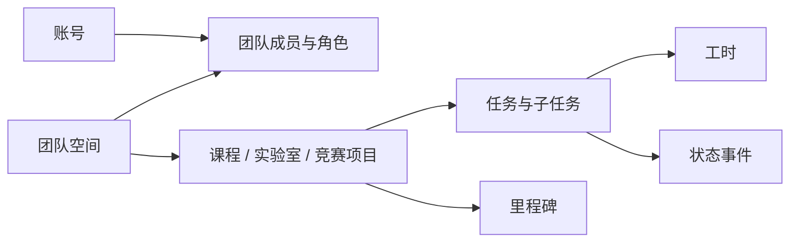
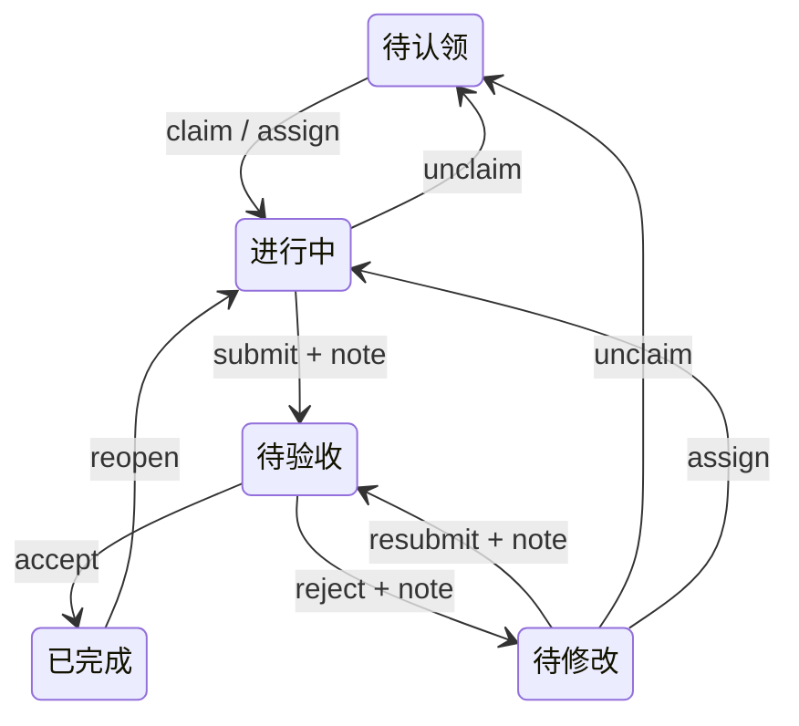

# 协作链路与状态机 · v0.3

AgileNest 面向高校课程设计、实验室课题和竞赛团队。团队聚集成员，项目承载目标，任务承载可交付工作。实验室本期采用团队 + lab 类型项目，不新增独立的数据/文件/设备模型。

## 数据与导航链路

项目访问权限继承团队成员关系；用户在不同团队内的角色可以不同。邀请码加入默认学生，由管理员设置教师。团队空间展示成员与 active 项目数量，项目卡片展示顶层任务状态分布，完成度为已验收顶层任务 / 顶层任务总数。

| 页面 | 用途 |
|---|---|
| /t | 团队卡片，创建/加入与上手路径 |
| /t/[teamId]/projects | 项目与课题卡片、类型筛选、创建项目 |
| /t/[teamId]/members | 成员卡片、角色说明与管理员调整入口 |
| /p/[projectId] | 项目概览，指向看板、任务池、个人任务/验收台 |
| /p/[projectId]/board | 五态看板、合法拖拽与详情侧栏 |
| /p/[projectId]/table | 同一数据的表格视图，保留筛选 |
| /p/[projectId]/tasks/[taskId] | 状态路径、说明、子任务、工时与活动记录 |
| /home/student · /home/teacher | 各角色的待办与验收入口 |

## 五态唯一真相

`assign` 也允许在进行中重新指派负责人。只有 `accepted` 是已完成；提交不直接完成。待修改是验收反馈分支，修改后回到待验收。状态代码与数据库 enum 保持兼容。

模块内部 `tasks/states.ts` 的 `TRANSITIONS` 是唯一合法边集合，`ACTION_ROLES` 约束角色，`availableTransitions(task, role, actorId)` 进一步约束学生负责人权限。界面和看板复用这些公开规则，服务端再次检查，不信任客户端。

## 动作与角色

| 动作 | 学生 | 教师 | 管理员 |
|---|---|---|---|
| 查看本团队项目与成员 | 可 | 可 | 可 |
| 创建任务 | 可 | 可 | 可 |
| 认领 | 可 | 不可 | 可 |
| 提交 / 重交 | 自己的任务 | 不可 | 可代提交已有负责人任务 |
| 退回任务池 | 自己的任务 | 可 | 可 |
| 指派 / 验收 / 打回 / 重新打开 | 不可 | 可 | 可 |
| 创建项目 / 改成员角色 | 不可 | 不可 | 可 |

执行负责人选择学生或管理员，教师承担验收职责。提交/重交需完成说明；打回需修改意见；指派要求真实团队成员。创建时指定负责人同样校验，学生不能通过创建接口指派别人。成员查询也在 service 中检查访问权限。角色调整锁定团队，禁止降级最后一位管理员。

## 写入与刷新

`transitionTask()` 是所有既有任务状态变更入口：先检查项目访问/角色，在事务内锁定任务，读取最新状态并查表，最后同时写任务与活动事件。并发认领会让后一请求看到新的状态并返回 409。通知在事务提交后发送，失败不撤销任务操作。

看板移动通过 `moveTask()` 调用任务公开契约；带说明的移动支持 `note`。状态、负责人和普通属性分别提交，混合写入明确拒绝，避免静默丢弃字段。页面在服务端确认后更新；取消或失败仍留在原列。

Server Actions 刷新实际任务所属项目的页面，包含看板、表格、详情、验收台与工作台。任务详情同时校验 URL 中的 projectId 和任务真实归属。活动记录可追踪操作人、动作、说明，不宣称具有不可篡改存证能力。

## 多视图与实现边界

筛选用 URL 保存 `q/status/assigneeId/priority/milestoneId`，`groupBy` 控制看板分组。看板与表格切换保留条件。API 列顺序继续保持原有契约，页面将待修改放在已完成前；主路径图单独展示验收反馈分支。负责人/优先级/里程碑分组用于浏览，只有状态分组支持拖动。

路由只做组合壳；identity/tasks/board 的 service、actions、ui、views 分别负责权限业务、边界写入、客户端交互和服务端组装。业务跨模块只用根契约，公开 UI 入口登记于 [TEAM.md](TEAM.md)，客户端纯函数不导入 DB/session。登录链路、core、数据库结构和依赖均保留。

视觉恢复品牌 `#294a78`、点缀 `#bf6a34`，状态统一用 StatusPill。弹窗使用已有 Radix，拖动复用已有 dnd-kit；提供按钮等价入口、焦点管理与减少动效。完整交互规则、参考来源与手动验收见 [UX.md](UX.md)。

## 学术身份与叠加职务

已实现本科生、硕士生、博士生、老师身份信息与按团队确认；管理员、指导老师、队长、队员可叠加，权限按职务和项目场景决定。资料更新需要重新确认，队长协调实验室/竞赛，不独立验收。规则见 [身份与权限](IDENTITY.md)，来源与取舍见 [PR 调研](PR-RESEARCH.md)。
