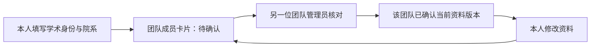

# 学术身份与团队权限 · v0.3

学术身份与团队职务分别保存。身份由本人填写，职务只能由所属团队管理员授予；本科、硕士、博士和老师均不自动获得任何管理权限。相同用户在不同团队可有不同职务，一人在一个团队可同时担任多项职务，权限取并集。

## 身份链路



`/settings` 提供本科生、硕士生、博士生、老师四张选择卡，可填写学校/机构、院系与研究方向。未填写身份的成员在团队页也能直接进入填写流程。身份确认是团队内部人工核对，没有接入学籍认证服务。

确认按团队与资料版本保存，包含确认人和时间。资料变更使所有旧版本确认失效；不修改内容直接保存不会失效。管理员也不能自我确认，需要另一位管理员核对。提交确认时服务端核对版本，避免管理员在旧页面上误确认新资料。

## 职务与场景

| 能力 | 管理员 | 指导老师 | 队长 | 队员 |
|---|---|---|---|---|
| 查看团队、项目、成员 | ✓ | ✓ | ✓ | ✓ |
| 授予职务、确认他人身份 | ✓ | — | — | — |
| 创建、维护课程项目 | ✓ | — | — | — |
| 创建、维护实验室/竞赛项目 | ✓ | — | ✓ | — |
| 创建、编辑任务 | ✓ | ✓ | ✓ | ✓ |
| 认领、提交自己任务 | ✓ | 叠加队长/队员时 | ✓ | ✓ |
| 指派、退回他人任务 | ✓ | ✓ | 仅实验室/竞赛 | — |
| 代提交他人任务 | ✓ | — | — | — |
| 验收、打回、重开、删除任务 | ✓ | ✓ | — | — |

指导老师同时是队员时，可以作为负责人、认领和提交自己的任务。纯指导老师负责安排和验收，负责人选择中只列出有执行职务的成员。队长在课程项目中保留个人任务能力，不能以队长身份指派或维护课程项目。

职务表不允许为空，最后一位管理员不能被降级。团队事务锁保护管理员交接与身份确认。成员不能自行升职，外人不能读取成员资料或操作另一团队；服务端每次重新解析当前职务，不信任页面中的权限快照。

## 与五态状态机配合

`identity/client.capabilitiesFor(positions, kind)` 是场景权限唯一入口；`tasks/states.TRANSITIONS` 是合法状态转移唯一入口。权限和状态共同决定按钮、拖动把手、可放入的列和服务端动作。队长权限不会改变五态或绕过验收。

任务服务返回当前操作者的 `TaskDTO.permissions`。旧工作台 DTO 在进入共享操作区时从任务服务补齐权限，再显示动作。页面中的权限只用于引导，服务端重新检查当前权限；管理员撤销职务后，旧页面上的请求仍会被拒绝。

保留 `team_members.role` 三态作为兼容字段，管理员优先映射 `admin`，指导老师映射 `teacher`，其他执行职务映射 `student`。未设置新职务的已有成员由旧角色推导：管理员、指导老师、队员。既有账号、登录 provider、JWT 和密码链路保留。

## 数据升级与验证

仅追加 `academic_profiles`、`member_positions`、`academic_confirmations` 与两个枚举，不重排既有 schema。已有数据库使用事务迁移，命令可重复执行：

```powershell
node scripts/migrate-identity.mjs
node scripts/migrate-identity.mjs --test
npm test
npm run build
```

新数据库仍可使用原有 `db:push` 初始化。若已有数据库的历史唯一约束名称与 Drizzle 定义不同，本次仅追加迁移不会触碰那些约束，也不要求清空用户数据。

新增契约覆盖四种身份、版本确认、团队隔离、自己/非管理员/外人的越权、空职务、管理员交接、场景范围、重叠职务、负责人筛选、撤权与非法状态转移。手动验收还应检查成员卡片和个人设置在窄屏可操作，错误提示保留输入，多选职务与确认按钮仅对管理员开放。

## 个人资料补充 · 2026-10-04

个人中心支持姓名、300 字简介与头像的选择、预览、替换、移除。图片先在浏览器居中裁切为 256×256 PNG，原图上限 5 MB，服务端再验证格式、尺寸和保存大小；列表只返回带版本的头像地址，不携带图片内容。头像接口验证本人或同团队关系，并用 ETag 与 private/no-cache 支持复用，撤销团队关系后不能绕过权限缓存读取。

个人资料存于追加的 `personal_profiles` 表，姓名保存在既有用户表；JWT 登录规则保持原有语义，界面从数据库读取最新姓名。本人保存资料无法传入其他用户作为更新对象。姓名修改会增加学术资料版本、使各团队旧确认失效；简介与头像修改不改变学术身份或职务权限。

已有数据库需分别运行 `node scripts/migrate-profiles.mjs` 和 `node scripts/migrate-profiles.mjs --test`。迁移只新增表，可重复执行，不清空历史数据。新库沿用 `db:push` 初始化。

个人资料表单区分已保存资料与本次草稿：保存成功清空上传草稿并更新还原基线；还原回到最近一次保存结果，失败保留输入。未修改时保存和还原按钮禁用，继续编辑后旧成功提示隐藏。

## 可选飞书连接 · 2026-10-04

平台账号、资料、学术身份、团队职务和协作功能独立于飞书。已绑定姓名可由本人选择填入个人资料草稿，保存后才改变本地姓名，不自动同步头像或身份，不从飞书推断职务或权限。采用飞书姓名仍触发姓名变更的身份确认失效规则。

未填写飞书应用 ID、密钥或回调地址时，个人中心显示暂未启用而不展示可点击的绑定入口；兼容现有登录入口的 `notice` 和回调的 `feishu` 参数。旧绑定记录不因暂时缺配置而丢失。

解绑只操作会话本人，先确认再提交；服务端事务锁定账号并校验绑定版本。旧页面、他人版本和无效输入不能清除当前绑定。飞书生成的 `@feishu.local` 账号没有用户可用的本地密码，当前禁止解绑以保留唯一登录方式；允许解绑的普通账号资料与权限保留。登录、绑定回调与 JWT 逻辑未改动。配置和联调边界见 [FEISHU.md](FEISHU.md)。
