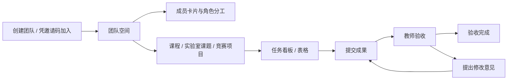

# 协作体验与验收 · v0.3

## 本期范围

本次优化覆盖团队空间、成员角色、课程/实验室/竞赛项目，以及任务五态交互。实验室指实验室成员、课题项目和导师验收，不涉及实验数据、设备台账或文件库。保留现有登录与依赖；身份权限仅追加独立表，不重排既有结构。

## 用户从哪里开始

团队管理成员，项目管理目标，任务管理可交付事项。项目成员权限来自所属团队，无需再次加入项目。同一用户在不同团队中可以拥有不同角色。

- 发起人：创建空间 → 复制邀请码 → 在成员页设置教师 → 建立项目 → 创建任务。
- 学生：凭邀请码加入 → 进入项目看板 → 认领 → 提交成果说明 → 等待验收，或按修改意见重交。
- 教师：由管理员设置教师角色 → 进入项目 → 按姓名指派 → 查看完成说明 → 通过或填写修改意见打回。

创建/加入团队成功后进入团队项目页；创建时选中的场景会带到项目类型，仍可修改；创建项目成功后直接进入看板。空列表给出下一步入口，错误在操作附近显示。

## 状态交互规则

四个主路径节点是待认领、进行中、待验收、已完成；待修改是验收反馈分支，不能误画成“已完成后的下一阶段”。看板将待修改放在已完成前，保留完整五态分列。

按钮和可拖入的列从同一转移表生成，并考虑角色与负责人。学生不能提交或退回其他学生的任务；教师可以在待认领、进行中、待修改阶段指派学生或管理员执行。无权限时说明由谁继续推进。

| 交互 | 行为 |
|---|---|
| 点击任务标题 | 打开侧边详情，展示当前节点、成果/修改意见和下一步 |
| 认领 / 验收通过 | 提交后刷新视图，给出成功/失败反馈 |
| 提交 / 重交 / 打回 | 先显示当前→目标状态，要求填写针对性的说明 |
| 指派 | 从真实团队成员中选择姓名，服务端重新验证归属 |
| 拖动任务把手 | 高亮合法目标，提交/打回/指派先补充必要字段 |
| 取消补充弹窗 | 不写数据，任务仍在原列 |
| 失败 / 非法状态 | 不提前移动卡片，显示中文错误与刷新建议 |
| 看板与表格切换 | 保留 URL 筛选，刷新/后退仍能恢复视图条件 |
| 按负责人/优先级/里程碑分组 | 浏览分工，推进状态使用任务操作或切换状态分组 |

提交等待服务端确认；不单独维护客户端状态副本。并发认领由数据库行锁串行化，状态与活动记录在同一事务中提交。活动记录用于追踪操作，不宣称为不可篡改存证。

## 视觉与可访问性

品牌蓝 `#294a78`、点缀 `#bf6a34`，用统一 tokens。状态同时提供中文文本与颜色，不仅依赖颜色。场景卡片使用 radio，成员职务使用带说明的多选框，指派使用有标签的 select；弹窗采用已有 Radix 组件提供焦点限制、Esc 关闭和返回触发元素。按钮路径是拖动的等价操作入口，窄屏通过局部横向滚动保留看板列，减少动效遵循系统偏好。

## 参考与取舍

以下是产品文档调研后对本项目的设计取舍，未移植其代码或改变现有状态语义。

| 参考 | 本次采用 |
|---|---|
| [飞书任务管理](https://www.feishu.cn/content/40gyakm8) | 同源多视图、筛选分组、负责人选择、任务详情 |
| [Plane 工作项](https://docs.plane.so/work-items/overview) · [开源仓库](https://github.com/makeplane/plane) | 状态、优先级、负责人在卡片中分层展示，侧边详情承接操作 |
| [OpenProject 工作流](https://www.openproject.org/docs/system-admin-guide/manage-work-packages/work-package-types/workflows/) · [开源仓库](https://github.com/opf/openproject) | 按角色约束合法转移，显示可执行的下一步 |

不照搬通用软件的完成状态：本项目只有教师/管理员验收通过才是已完成。甘特、Sprint、模板库、AI 模型执行和 Agent API 继续只列路线图；用户确认的 AI 对话界面与本地草稿单独实施。

## 手动验收清单

1. 空账号进入 `/t`，可从发起人/邀请码两张卡片开始；团队、项目创建成功均跳到下一步。
2. 新建实验室课题，确认 `lab` 类型与日期持久保存、颠倒日期被拒绝、卡片可独立筛选。
3. 管理员设置教师角色；教师能按姓名指派，学生不显示角色管理控件，最后一位管理员不能降级。
4. 学生认领→提交→教师打回→学生重交→教师通过→教师重新打开，详情和活动记录一致。
5. 拖入待验收/待修改时取消弹窗，卡片不移动；空说明、非法目标、其他学生的任务操作均被拒绝。
6. 搜索与筛选后切换表格、刷新、返回，条件仍保留；筛选无结果时可以重置。
7. 用键盘打开卡片、选择成员与填写说明，检查弹窗关闭和焦点返回；检查窄屏布局。

自动检查：`npm test`（真实 `agilecampus_test`，串行文件）和 Windows `npm run build`。无数据库时单跑 exports、core、password、tasks/states、board/board 纯函数用例，并在交付说明中明确缺少的验证。

## 本轮页面验证记录 · 2026-10-02

在本地开发模式使用演示管理员账号验证：实验室场景沿用、团队→课题→看板跳转、日期倒置提示与输入保留、任务创建、按姓名选择负责人、取消指派、拖拽认领、取消拖拽提交，以及提交→打回→重交→验收通过。弹窗取消后焦点返回原操作按钮，详情关闭后返回任务卡片；看板/表格切换保留搜索条件；390px 宽度下检查筛选换行和局部看板滚动。

新建了“实验室协作演示 / 课题协作体验验证”本地演示空间，便于复查；原有演示项目未用于修改操作。学生、教师和越权场景由契约测试验证，尚未逐角色完成页面人工回归。

最终检查：12 个测试文件、104 条用例全部通过；Windows `npm run build` 成功；本次修改的模块与新增契约测试通过 ESLint。

## 身份与权限补充 · 2026-10-03

本科、硕士、博士、老师独立于团队职务。成员卡片展示身份确认状态及多个职务，管理员才能赋职和确认他人身份。资料修改后需重新确认，队长在实验室/竞赛中可指派、维护项目，验收需指导老师或管理员。详细规则见 [IDENTITY.md](IDENTITY.md)，PR 调研见 [PR-RESEARCH.md](PR-RESEARCH.md)。

新增手动验收：本人保存资料→管理员确认→本人改资料后确认失效；多选队长+队员后在实验室看板指派，课程项目不出现指派；指导老师+队员可执行自己的任务，纯指导老师不出现在负责人列表。非管理员没有职务编辑和身份确认入口。

## 本轮页面验证记录 · 2026-10-03

使用本地演示管理员与队员账号验证本人身份填写、保存反馈、待确认状态、管理员确认后的徽章更新、队长+队员多选保存，以及非管理员没有职务管理/身份确认按钮。检查 390px 成员卡片布局，完成后恢复视口与管理员会话。项目设置的权限概览、字段保存与成功反馈也已点验。演示资料明确标记为示例学校。

提交前检查：全部 128 条测试通过，Windows 生产构建通过，本轮模块及项目导航 lint 通过；锁定的登录文件和项目依赖保持本轮开始时的内容。

## 协作完成度补充 · 2026-10-04

页面根据对象与操作选择列表、表格、分区或卡片，避免把所有数据包装为卡片。统一导航名称为“任务池”；日历、里程碑使用项目语境；个人设置与消息中心各有明确入口。

工作台同时提供我负责的、待我验收、可以认领，按每个项目的当前职务计算权限。旧 student/teacher 地址保留为同一工作台的不同默认视图。项目概览状态数量直接打开保留 URL 筛选的表格，风险事项打开对应任务，里程碑打开关联任务。

任务详情提供可取消的编辑弹窗与子任务创建入口；编辑覆盖标题、目标/验收要求、日期、优先级、预计工时、里程碑。错误保留输入，保存后刷新相关视图。全部子任务通过后才能验收父任务；已完成子任务重开前先重开父任务。删除先明确提示连带范围，取消保留数据，失败显示原因，成功回到任务池。

个人中心支持头像预览/替换/移除、姓名和简介，保存后侧栏与团队成员同步。窄屏资料表单为单列；弹窗支持焦点限制、Esc 取消和关闭后返回触发按钮。消息列表区分已读/未读并直达任务。

项目完成度按已验收顶层任务计算，子任务进度单独显示。性能措施为成员范围关联查询、一次聚合完成度、权限快照避免逐卡请求、头像压缩与 ETag；不以开发模式首次编译时间宣称生产性能。

## 本轮页面验证记录 · 2026-10-04

本地演示管理员验证项目状态数字跳到对应 URL 筛选、完整任务编辑的日期错误与输入保留、保存刷新、取消编辑/删除、空子任务列表创建与返回父任务、认领后工时入口、记录 30 分钟后贡献统计同步、消息未读筛选与标记已读。个人资料已验证头像上传、预览、保存、重载持久化与侧栏同步；390×844 下检查个人中心、消息和可滚动编辑弹窗，完成后恢复默认视口。新增事项均明确标为本地演示；混合职务与越权由真实数据库契约验证。

最终验证：20 个测试文件、162 条用例全部通过；Windows `npm run build` 通过；所有本轮源码通过 ESLint，`git diff --check` 通过。生产性能未进行负载测试，本轮验证查询次数与数据传输改进及实际页面响应。

## 产品文案与工作台规则 · 2026-10-04

- 页面标题使用功能名称，如工作台、团队空间、个人中心、消息中心。姓名仅用于成员、负责人和账号识别，不写问候、励志标语或重复的英文标题。
- 空状态说明缺少什么、允许执行什么动作；筛选为空与对象尚未创建分别显示，并提供清除筛选或创建/加入入口。操作反馈使用已保存、已提交、已通过等事实描述。
- 执行与验收使用职务语义，避免把学生/老师身份等同于权限。必要的权限、日期和表单提示保留。
- 有数据的团队页不重复展示新手流程；任务池流程可展开查看。工作台分类与计数只展示一次，搜索、项目、截止日期共同筛选；切换分类、刷新、返回保留 URL 条件。

参考 [Linear My issues](https://linear.app/docs/my-issues) 的个人任务分类与优先事项排序，以及[飞书项目工作台](https://www.feishu.cn/content/3c6y1qwl)的事项筛选和工作入口。本项目保留原有五态验收语义，采用既有品牌、组件和权限契约。

本轮页面验收：演示管理员验证搜索/项目/七天内日期组合筛选、分类切换保留条件、刷新恢复、键盘回车搜索、无结果重置，以及任务池流程键盘展开。工作台、个人中心、消息列表在 390×844 视口下检查换行与页面宽度；已有团队/项目页不再显示新手流程。旧自动通知展示更新后的状态文案，成果说明与修改意见原文保留。最终恢复默认视口。

最终检查：21 个测试文件、175 条用例通过，Windows 生产构建、全部本轮源码 ESLint 和 `git diff --check` 通过。工作台移除问候资料查询，筛选消费同一次权限范围查询的结果，没有新增逐任务请求。未进行生产负载测试。

## 个人中心与可选连接验收 · 2026-10-04

个人资料明确展示未保存修改；保存成功后以服务端结果更新还原基线、清空头像上传草稿，无修改时禁止重复提交。继续编辑后隐藏旧成功反馈；失败保留输入。飞书姓名只由本人选择填入草稿，保存后才生效，保留现有身份确认规则。

飞书分区显示未绑定、已绑定或暂未启用；应用 ID、密钥或回调地址缺失时隐藏绑定入口。现有绑定不因缺配置而清除；私信尚未启用，消息入口直达站内收件箱。解绑先确认，支持 Esc、焦点返回、等待与错误提示；服务端拒绝旧版本或丢失唯一登录方式的操作。

本地管理员已验证空白姓名错误保留、键盘还原、简介保存后再编辑与还原、头像移除后还原及无修改按钮禁用，结束后恢复原资料。独立演示账号 `connection-qa@agilecampus.local` 使用明确标为本地模拟的飞书姓名，验证采用姓名的草稿/还原/保存、解绑弹窗 Esc 取消与焦点返回、头像上传后草稿清空、头像 URL 与姓名刷新持久化；未调用飞书授权或发送私信。最终恢复管理员会话。390×844 下个人中心与连接分区无页面横向溢出，已恢复默认视口。关闭遮挡折叠侧栏账号操作的开发工具浮标后，退出按钮点验通过。

最终本地检查：22 个测试文件、183 条用例通过；Windows 生产构建、identity 与公共配置 ESLint、`git diff --check` 通过。设置页仍并行读取三个本人摘要，没有新增远程请求；保存后避免重复传送头像 data URL。未进行生产负载测试，生产环境认证配置不在本轮验证范围。

CI 暴露历史锁文件的平台项缺少可选标记后，在独立目录以 npm 重算原有依赖图，并分别完成 Windows npm 10/11 的 npm ci 全新安装；新安装环境下全部 183 条测试和生产构建再次通过。保留条目的版本、下载来源和完整性值未改变，业务依赖声明未改变。

## AI 对话页面 · 2026-10-05

本轮用户确认界面与本地草稿。AI 入口属于“工作空间”，沿用侧栏细线图标、选中状态与品牌色；不增加独立浮窗。桌面对话草稿列表可收起，移动端为带焦点限制的 Radix 抽屉；正文区与底部输入区保持稳定，较矮窗口允许正文局部滚动，避免居中内容的顶部被裁切。

页面标题为 AI 对话，提供项目规划、任务拆解、验收准备和课题讨论提纲；点击后加入输入，保留原有内容。模型未接入的状态一直可见，发送禁用，没有问候、虚构 AI 回复或 Agent 执行过程。草稿输入在 450ms 后保存，操作前补保存；反馈仅在写入成功后显示已保存。失败保留输入、原存储损坏时拒绝覆盖；帮助说明保存范围、数量和字数限制。

页面验证：从主页进入，提纲填入、Ctrl+Enter/失焦保存、刷新恢复正文和自定义名称、新建与切换两份本地验收草稿、搜索无结果/清除搜索、复制、重命名，以及删除确认 Esc 取消后内容和数量保留、焦点回到菜单按钮。删除结果由纯函数测试验证，页面未确认删除演示草稿。390×844 下无页面横向溢出，草稿抽屉 Esc 后回到触发按钮；折叠侧栏仍有 AI 图标与 aria-current，结束后恢复默认视口和原侧栏偏好。

自动检查新增草稿用例与现有业务完整测试；模型、跨设备同步和任务自动写入未实现。参考与取舍见 [AI.md](AI.md) 与 [PR-RESEARCH.md](PR-RESEARCH.md)。

最终检查：23 个文件、192 条测试通过，Windows 生产构建、本轮源码 ESLint 与 `git diff --check` 通过。路由仅传入会话用户标识，没有新增 DB/任务请求；浏览器写入做 450ms 合并，数量与长度有上限。不宣称已验证模型响应或生产负载。

## 个人日历 · 2026-10-05

从工作空间“个人日历”进入本人时间安排，项目区域仍保留“项目日历”。复用原有品牌色、细线日历图标、表单和 Radix；月历是日期导航，右侧当日列表承担新增/编辑/删除，移动端列表置于月历下方。小屏格子显示事项数，大屏显示前两项的时间和标题；余项在当日列表完整查看，颜色同时配文字优先级。

搜索、优先级、月份与选中日期保存于 URL。无安排提供新增入口，无匹配可清除筛选；保存后显示实际日期并清除筛选以呈现结果。全天/定时选择有标签；日程说明完整换行，标题限制长度，不要求填写账号或数据库 ID。

弹窗打开聚焦标题，删除弹窗优先聚焦取消；Esc/取消不写入，关闭返回原按钮。提交期间防重复和关闭，失败保留受控输入；非法起止时间在表单附近显示原因。个人安排不会触发任务状态、验收或通知；原项目月视图保留权限与任务链接，路由只组合 calendar/views。

页面验收：新建定时安排，颠倒时间返回中文提示且标题/说明保留；修正后保存、刷新恢复、编辑时间和说明；新建全天安排到另一日期，保存后进入正确日期。标题搜索/优先级组合筛选、无结果清除、切月条件保留与返回今天通过；删除弹窗先聚焦取消，Esc 后记录保留。手机弹窗、导航和月历在 390×844 无横向溢出，桌面折叠入口保留标题及 aria-current，验证后恢复视口和侧栏偏好。仅创建两份明确标注“本地日历验收”的本人安排；页面未确认删除数据，删除成功由隔离库契约测试验证。

自动检查：25 个文件、220 条测试通过（新增 28 条日历服务/HTTP/查询与数据库约束用例），Windows `npm run build`、本轮源码 ESLint 和 `git diff --check` 通过。开发库和测试库追加迁移完成，测试迁移重复执行成功；没有清空开发数据，没有修改 core、登录文件或依赖。按月查询与分组的验证不代表已完成生产负载测试。

## 交互反馈与发布候选 · 2026-10-06

共享 Button 通过 loading 展示细线等待图标、aria-busy 和禁用，任务操作仅当前点击项显示等待；成功提示由 AppShell 承载，最多三条、六秒后消失且可手动关闭。表单错误留在输入附近，带文字和图标，不依赖颜色。任务创建、编辑和日程等待时阻止重复操作与弹窗关闭；点击、弹窗和抽屉使用短动效，系统减少动画偏好关闭这些动效。

在独立便携目录完成演示账号登录、新建任务、认领、提交说明、取消提交与验收台活动查看。新建关闭后仍看到“已创建”；日程颠倒时间得到错误且输入保留，修正后关闭弹窗仍看到“日程已保存”。日程弹窗与验收抽屉在 390×844 无页面横向溢出，Esc 后焦点分别回到新建日程和抽屉按钮；创建任务打开时聚焦标题。抽屉小屏内容改为单一纵向滚动，活动加载失败提供重试。

Windows PowerShell 5.1 实测首次初始化、完整本地依赖、重复启动复用、停止、重启和追加迁移。重启后保留验收任务、成果说明和个人日程；初始化只创建一份示例空间，后续启动不覆盖账号资料。修复原生 PowerShell 编码、依赖追踪遗漏与路径格式差异，日志在数据目录外。开发数据库未清空，运行包不带开发 .env。

自动验证：29 个文件、283 条契约用例，Windows 生产构建、本轮源码 ESLint 与格式检查通过。新增用例验证 PR #7 排期整合、历史月份、可见窗口展开、筛选、旧 DTO 字段、接口越权和非法输入；实际生产负载、飞书私信和真实模型不在此次验证范围。

ZIP 在含中文和空格的独立目录解压后发现上游 PostgreSQL 初始化编码限制；rc.3 使用目标受核对的临时 ASCII 盘符处理，首次运行、重复启动、停止与映射清理已实际通过。数据库仍保存原目录，盘符不覆盖既有盘符；错误由独立 initdb-error.log 保留。rc.2 的 GitHub Verify 两项均通过；正式发布使用后续已验证提交。
