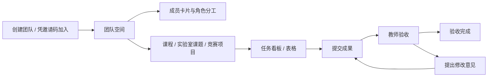

# 协作体验与验收 · v0.3

## 本期范围

本次优化覆盖团队空间、成员角色、课程/实验室/竞赛项目，以及任务五态交互。实验室指实验室成员、课题项目和导师验收，不涉及实验数据、设备台账或文件库。保留现有登录与依赖；身份权限仅追加独立表，不重排既有结构。

## 用户从哪里开始

团队管理成员，项目管理目标，任务管理可交付事项。项目成员权限来自所属团队，无需再次加入项目。同一用户在不同团队中可以拥有不同角色。

- 发起人：创建空间 → 复制邀请码 → 在成员页设置教师 → 建立项目 → 创建任务。
- 学生：凭邀请码加入 → 进入项目看板 → 认领 → 提交成果说明 → 等待验收，或按修改意见重交。
- 教师：由管理员设置教师角色 → 进入项目 → 按姓名指派 → 查看完成说明 → 通过或填写修改意见打回。

创建/加入团队成功后进入团队项目页；创建时选中的场景会带到项目类型，仍可修改；创建项目成功后直接进入看板。空列表给出下一步入口，错误在操作附近显示。

## 状态交互规则

四个主路径节点是待认领、进行中、待验收、已完成；待修改是验收反馈分支，不能误画成“已完成后的下一阶段”。看板将待修改放在已完成前，保留完整五态分列。

按钮和可拖入的列从同一转移表生成，并考虑角色与负责人。学生不能提交或退回其他学生的任务；教师可以在待认领、进行中、待修改阶段指派学生或管理员执行。无权限时说明由谁继续推进。

| 交互 | 行为 |
|---|---|
| 点击任务标题 | 打开侧边详情，展示当前节点、成果/修改意见和下一步 |
| 认领 / 验收通过 | 提交后刷新视图，给出成功/失败反馈 |
| 提交 / 重交 / 打回 | 先显示当前→目标状态，要求填写针对性的说明 |
| 指派 | 从真实团队成员中选择姓名，服务端重新验证归属 |
| 拖动任务把手 | 高亮合法目标，提交/打回/指派先补充必要字段 |
| 取消补充弹窗 | 不写数据，任务仍在原列 |
| 失败 / 非法状态 | 不提前移动卡片，显示中文错误与刷新建议 |
| 看板与表格切换 | 保留 URL 筛选，刷新/后退仍能恢复视图条件 |
| 按负责人/优先级/里程碑分组 | 浏览分工，推进状态使用任务操作或切换状态分组 |

提交等待服务端确认；不单独维护客户端状态副本。并发认领由数据库行锁串行化，状态与活动记录在同一事务中提交。活动记录用于追踪操作，不宣称为不可篡改存证。

## 视觉与可访问性

品牌蓝 `#294a78`、点缀 `#bf6a34`，用统一 tokens。状态同时提供中文文本与颜色，不仅依赖颜色。场景卡片使用 radio，成员职务使用带说明的多选框，指派使用有标签的 select；弹窗采用已有 Radix 组件提供焦点限制、Esc 关闭和返回触发元素。按钮路径是拖动的等价操作入口，窄屏通过局部横向滚动保留看板列，减少动效遵循系统偏好。

## 参考与取舍

以下是产品文档调研后对本项目的设计取舍，未移植其代码或改变现有状态语义。

| 参考 | 本次采用 |
|---|---|
| [飞书任务管理](https://www.feishu.cn/content/40gyakm8) | 同源多视图、筛选分组、负责人选择、任务详情 |
| [Plane 工作项](https://docs.plane.so/work-items/overview) · [开源仓库](https://github.com/makeplane/plane) | 状态、优先级、负责人在卡片中分层展示，侧边详情承接操作 |
| [OpenProject 工作流](https://www.openproject.org/docs/system-admin-guide/manage-work-packages/work-package-types/workflows/) · [开源仓库](https://github.com/opf/openproject) | 按角色约束合法转移，显示可执行的下一步 |

不照搬通用软件的完成状态：本项目只有教师/管理员验收通过才是已完成。甘特、Sprint、模板库、AI 和 Agent API 继续只列路线图。

## 手动验收清单

1. 空账号进入 `/t`，可从发起人/邀请码两张卡片开始；团队、项目创建成功均跳到下一步。
2. 新建实验室课题，确认 `lab` 类型与日期持久保存、颠倒日期被拒绝、卡片可独立筛选。
3. 管理员设置教师角色；教师能按姓名指派，学生不显示角色管理控件，最后一位管理员不能降级。
4. 学生认领→提交→教师打回→学生重交→教师通过→教师重新打开，详情和活动记录一致。
5. 拖入待验收/待修改时取消弹窗，卡片不移动；空说明、非法目标、其他学生的任务操作均被拒绝。
6. 搜索与筛选后切换表格、刷新、返回，条件仍保留；筛选无结果时可以重置。
7. 用键盘打开卡片、选择成员与填写说明，检查弹窗关闭和焦点返回；检查窄屏布局。

自动检查：`npm test`（真实 `agilecampus_test`，串行文件）和 Windows `npm run build`。无数据库时单跑 exports、core、password、tasks/states、board/board 纯函数用例，并在交付说明中明确缺少的验证。

## 本轮页面验证记录 · 2026-10-02

在本地开发模式使用演示管理员账号验证：实验室场景沿用、团队→课题→看板跳转、日期倒置提示与输入保留、任务创建、按姓名选择负责人、取消指派、拖拽认领、取消拖拽提交，以及提交→打回→重交→验收通过。弹窗取消后焦点返回原操作按钮，详情关闭后返回任务卡片；看板/表格切换保留搜索条件；390px 宽度下检查筛选换行和局部看板滚动。

新建了“实验室协作演示 / 课题协作体验验证”本地演示空间，便于复查；原有演示项目未用于修改操作。学生、教师和越权场景由契约测试验证，尚未逐角色完成页面人工回归。

最终检查：12 个测试文件、104 条用例全部通过；Windows `npm run build` 成功；本次修改的模块与新增契约测试通过 ESLint。

## 身份与权限补充 · 2026-10-03

本科、硕士、博士、老师独立于团队职务。成员卡片展示身份确认状态及多个职务，管理员才能赋职和确认他人身份。资料修改后需重新确认，队长在实验室/竞赛中可指派、维护项目，验收需指导老师或管理员。详细规则见 [IDENTITY.md](IDENTITY.md)，PR 调研见 [PR-RESEARCH.md](PR-RESEARCH.md)。

新增手动验收：本人保存资料→管理员确认→本人改资料后确认失效；多选队长+队员后在实验室看板指派，课程项目不出现指派；指导老师+队员可执行自己的任务，纯指导老师不出现在负责人列表。非管理员没有职务编辑和身份确认入口。

## 本轮页面验证记录 · 2026-10-03

使用本地演示管理员与队员账号验证本人身份填写、保存反馈、待确认状态、管理员确认后的徽章更新、队长+队员多选保存，以及非管理员没有职务管理/身份确认按钮。检查 390px 成员卡片布局，完成后恢复视口与管理员会话。项目设置的权限概览、字段保存与成功反馈也已点验。演示资料明确标记为示例学校。

提交前检查：全部 128 条测试通过，Windows 生产构建通过，本轮模块及项目导航 lint 通过；锁定的登录文件和项目依赖保持本轮开始时的内容。
